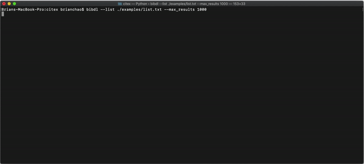

# bibdl
> Automatically generate BibTeX style references for ml/dl papers.

<p align=center>
    
</p>

## Installation
> Build locally. You can easily customize the code.
```
git clone https://github.com/Mckinsey666/bibdl.git
cd bibdl
python3 -m pip install .
```

## Usage
```
bibdl --list list.txt --bib refs.bib
```
List all paper titles in `list.txt`. `bibdl` will spawn multiple processes to search for the papers on arXiv and paperswithcode.com and generate BibTeX style references in `refs.bib`. 
   
Papers that are not found will be listed in `not_found.txt`. You'll have to manually find references for those papers.

## Disclaimer
This is not expected to be a search engine, so make sure you get your paper titles exactly right (or you might not be able to find anything). I simply hate looking for which conference a paper is submitted to, manually copying references, and finally formatting them, so just let the computer do their work. 
   
If you get most of your paper titles right, (usually) the script finds 70% or more papers in the list. For 100 papers, the process (usually) finishes in less than 10 secs.

## Sources
- arXiv
- Papers with Code
- NIPS proceedings page

## TODO
- Semantics Scholar
- IEEE Explore (need key)
